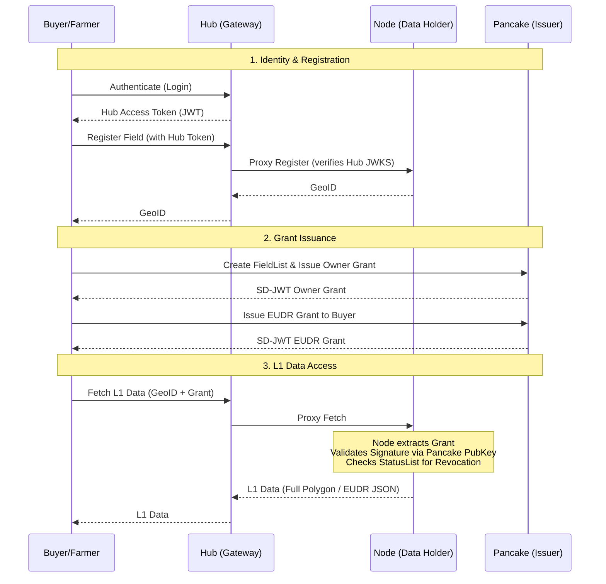

# AgStack DPI Trust Architecture

The Digital Public Infrastructure (DPI) for the Asset Registry consists of three primary components that separate Identity, Authorization, and Data Storage.

## Core Principles

1. **The Hub Routes But Never Authorizes**: The Hub serves as the identity anchor and API gateway. It authenticates users, issues standard JWTs, and proxies requests to the correct geographical backend Node. However, it *cannot* authorize access to L1 high-resolution data on its own.
2. **L1 Requires a Grant Credential**: The underlying Node holds the high-resolution field geometries. It will only expose this data (L1 access) if presented with a cryptographically signed ODRL Grant (SD-JWT format). The owner of the field is automatically the first grantee and must explicitly issue grants to other parties.

## System Diagram

## Component Roles

### 1. The Gateway (`ar2-hub`)
- **Identity Provider**: Authenticates Farmers, Buyers, and Service Providers.
- **Router**: Analyzes incoming requests (e.g., coordinates) and routes them to the correct backend Asset Registry Node.
- **JWT Issuer**: Exposes a `.well-known/jwks.json` endpoint so backend Nodes can securely verify that a write-request originated from an authenticated Hub session.

### 2. The Asset Registry Node (`ar2`)
- **Data Holder**: Stores the registered field boundaries, masked representations (L0 S2 indices), and metadata.
- **Verifier**: The ultimate authority on authorization. It allows anonymous L0 access (masked data) but strictly enforces L1 access by verifying cryptographic ODRL Grants.
- **EUDR Compiler**: Assembles the necessary compliance exports when valid grants are presented.

### 3. Pancake Issuer
- **Credential Issuer**: Mints W3C Verifiable Credentials (SD-JWT format) embodying ODRL Grants.
- **Revocation Manager**: Maintains a `StatusList2021` registry, allowing Data Owners to instantly revoke previously issued credentials.
