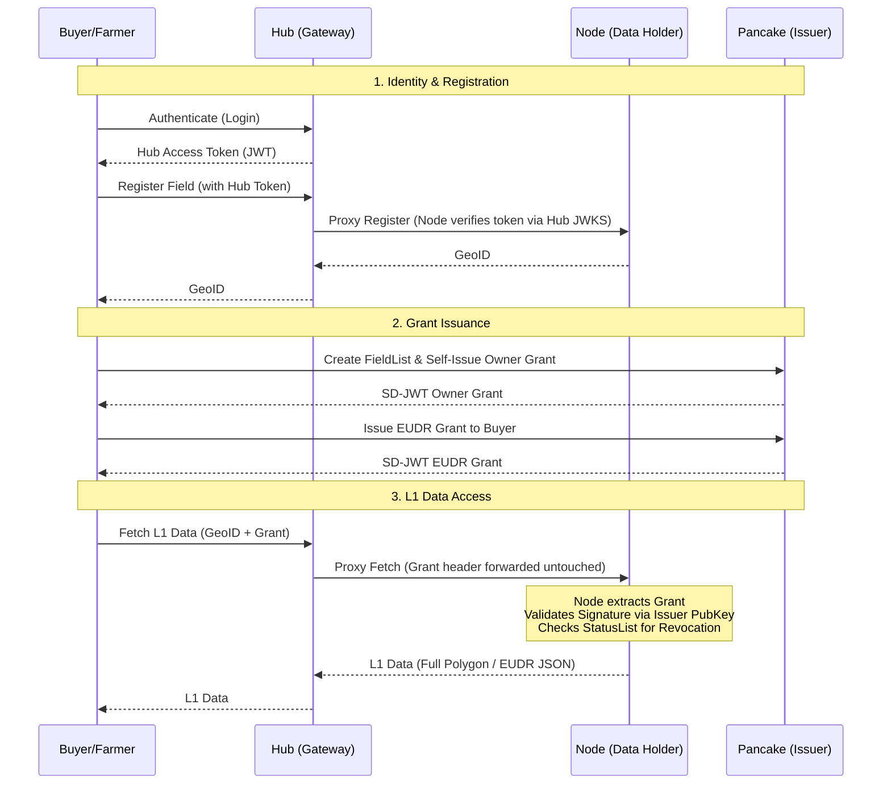

# AgStack DPI Trust Architecture

The Digital Public Infrastructure (DPI) for the Asset Registry consists of three primary components that separate Identity, Authorization, and Data Storage.

## Core Principles

1. **The Hub Routes But Never Authorizes**: The Hub serves as the identity anchor and API gateway. It authenticates users, issues standard JWTs, and proxies requests to the correct geographical backend Node. However, it *cannot* authorize access to L1 high-resolution data on its own — the authorization decision is always made at the Node, next to the data.
2. **L1 Requires a Grant Credential**: The underlying Node holds the high-resolution field geometries. It will only expose this data (L1 access) if presented with a cryptographically signed ODRL Grant (SD-JWT format). Ownership is a claim, not a registry flag: by convention, whoever registers a field self-issues an **owner grant** through the issuer service — the owner is simply the first grantee, and uses the same credential rail as everyone else. Access for any other party requires a grant explicitly issued by a claimant.

## Masking Levels

| Level | Who gets it | What is returned |
|-------|-------------|------------------|
| **L0** | Anyone (anonymous, or any login without a grant) | The S2 Level-10 cell polygon containing the field (~10 km scale), the country, and the area rounded to one decimal. Privacy is a property of the response construction, not a policy promise. |
| **L1** | Holders of a valid, unexpired, unrevoked grant credential for the field | The exact geometry (WKT / GeoJSON), and access to the EUDR-profile export. |

A malformed, expired, or revoked credential never produces an error on fetch endpoints — it degrades gracefully to L0. The EUDR export endpoint, whose entire purpose is L1 data, returns `401` instead.

## System Diagram

### Direct Node Access — the proxy is a convenience, not a trust requirement

The diagram shows the Hub relaying responses because that is what the current gateway does — but nothing in the trust model depends on it. **Nodes are directly addressable**: a client can present the same `X-Field-Grant` credential straight to a Node and receive the same L1 response, with the Hub entirely absent from the exchange. The Node performs all verification locally (signature, expiry, disclosures, revocation); the Hub adds routing, never authority. If the Hub is down, Nodes continue to serve anonymous L0 and credentialed L1 without interruption. The roadmap target is **resolver mode** — the Hub answers "which Node holds this GeoID" and redirects, rather than relaying payloads — which removes the Hub from the data path entirely. Data sovereignty is a property of the topology, not a policy.

## Trust Establishment

How does a Node decide which credential issuers to trust?

- **Today (this release):** static key pinning. Each Node is configured with the trusted issuer's Ed25519 public key (`AR_TRUSTED_ISSUER_PUBKEY`). Credentials signed by any other key are rejected and the request degrades to L0. The issuer identifies itself in credentials as a `did:web` identifier.
- **Roadmap:** a Hub-anchored issuer trust registry. The Hub, as the federation's trust anchor, will publish the set of accredited issuer keys (with rotation and revocation), and Nodes will resolve trusted keys from it instead of pinning a single PEM. This mirrors the trust-framework layer of the IDSA/DSSC dataspace model: the Hub accredits participants; it still never sees or authorizes the data itself.

## Legacy Compatibility

The fetch endpoints honor an `AR_ACCOUNT_L1=legacy` environment flag which, when set, restores the AR 1.0 behavior of granting L1 to any authenticated account. It is **off by default and disabled in all demo and reference deployments**. It exists solely to bridge existing AR 1.0 / TerraPipe account holders until their access lists are migrated into FieldLists and owner grants, after which the flag will be removed.

## Component Roles

### 1. The Gateway (`ar2-hub`)
- **Identity Provider**: Authenticates Farmers, Buyers, and Service Providers.
- **Router**: Analyzes incoming requests (e.g., coordinates) and routes them to the correct backend Asset Registry Node. Reads are public; writes require an authenticated Hub session. The `X-Field-Grant` header is forwarded untouched — the Gateway never parses, evaluates, or enforces grants.
- **JWT Issuer**: Exposes a `.well-known/jwks.json` endpoint so backend Nodes can securely verify that a write-request originated from an authenticated Hub session.

### 2. The Asset Registry Node (`ar2`)
- **Data Holder**: Stores the registered field boundaries and metadata; serves the masked L0 view publicly.
- **Verifier**: The ultimate authority on authorization. It allows anonymous L0 access (masked data) but strictly enforces L1 access by verifying cryptographic ODRL Grants — offline, against the pinned issuer key and the public status list.
- **EUDR Compiler**: Assembles the necessary compliance exports when valid grants are presented.

### 3. Pancake Issuer
- **Credential Issuer**: Mints W3C-style Verifiable Credentials (SD-JWT format) embodying ODRL Grants.
- **Revocation Manager**: Maintains a `StatusList2021` registry, allowing Data Owners to instantly revoke previously issued credentials — per grant, without affecting any other grantee's access.

## Standards Inventory

| Concern | Standard / mechanism in use |
|---------|------------------------------|
| Credential format | SD-JWT VC (selective disclosure), Ed25519 (EdDSA) signatures |
| Usage control | Embedded ODRL Agreement (purpose constraint, expiry, duties) |
| Revocation | W3C StatusList2021, published unauthenticated, checked at the Node |
| Issuer identity | `did:web` identifier in the `iss` claim |
| Hub identity tokens | RS256 JWTs, published JWKS (`/.well-known/jwks.json`) |
| Privacy masking | S2 geometry (Level-10 cell substitution for L0) |
| Compliance export | EUDR-profile GeoJSON — RFC 7946, WGS84, 6-decimal precision, ring winding |
| Field naming | Deterministic GeoID (SHA-256 over the S2 cell cover — same boundary, same ID) |

## Replaceability

Every component here is a **reference implementation of an open interface**. The Node, the Gateway, and the Issuer can each be replaced by an independent implementation that speaks the same contracts (GeoID computation, the grant credential profile, StatusList2021, the JWKS handshake) without any change to the others. What is fixed is the thin waist — the GeoID namespace, the Hub's role as trust anchor, and the credential/list specifications — not the software.
