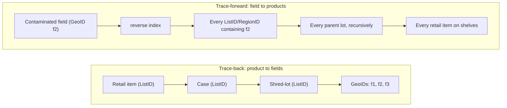
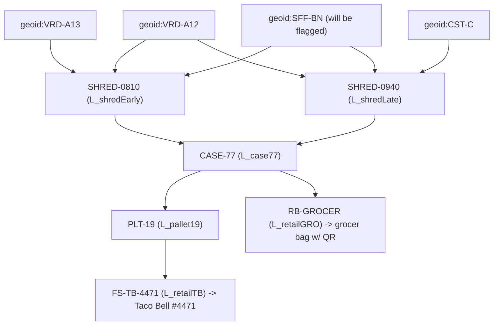
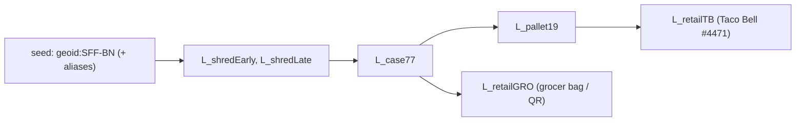

# Trace-Back and Trace-Forward on the Asset Registry Node

**Status:** design + build reference for the trace-forward feature landing on this branch (`ListArtifact`, `RegionArtifact`, reverse edges, authority gating). Read this alongside [ARCHITECTURE.md](./ARCHITECTURE.md) — that document explains the identity/authorization/storage split; this one explains how the same primitives answer *"where did this come from?"* and *"where did it go?"* for a food-safety recall.

---

## 1. Two questions, one graph

Every unit of food is grown on land. On this node, a parcel of land has a **GeoID** — a content-derived identifier (the hash of the S2 cell cover of its boundary), so the *same physical field always resolves to the same identifier*, computed by anyone, with no central allocator (see the Identity Resolution engine in [ARCHITECTURE.md](./ARCHITECTURE.md)). Product is aggregated as it moves: field lots are blended into processing lots, lots into cases, cases onto pallets, pallets into the packages and produce stickers a consumer finally scans. Each aggregation is a **list of what went into it**.

Two questions matter when something goes wrong:

- **Trace-back** — *"This bag of lettuce made people sick. Which fields is it made from?"* Start at a product identifier, walk **down** to the constituent GeoIDs. This is the direction incumbent systems already do reasonably well, and it is the direction the owner of a product is naturally entitled to ask about their own product.
- **Trace-forward** — *"This field is contaminated. Every product anywhere that contains it must be found and pulled."* Start at a GeoID, walk **up and out** to every list that ever included it, and every parent lot above those, all the way to the retail item. This is the hard direction, and the valuable one during an outbreak.



The crucial asymmetry is **who owns the privacy at stake**. Trace-back exposes *your own* supply base — you are entitled to it, but only for product you actually hold. Trace-forward exposes *other parties' commercial relationships* — the reverse edges are literally "who bought from whom." So both directions are credentialed; trace-forward is **additionally** authority-gated (§2.1, §6).

### 2.1 Neither direction is open: the node authorizes every trace

This bears stating before anything else, because it is the first thing people assume wrongly. **There is no anonymous or open traceability query on this node.** Both trace-back and trace-forward are available *only* to a caller the node has itself verified as an authorized user for that specific query:

- **The node is the enforcement point — always.** Per the first principle in [ARCHITECTURE.md](./ARCHITECTURE.md), *the Hub routes but never authorizes*. The Hub authenticates a session and proxies the request; the **node** independently verifies the presented credential (`verify_sdjwt_grant` in `app/grant_verifier.py`, reached via `app/auth.py`) against the trusted issuer key and the revocation StatusList. A request that merely arrived through the Hub is not authorized by that fact.
- **Trace-back requires a credential for the product being traced.** It is "self-service" only in the sense that it needs **no authority credential** — the caller still has to hold a valid, unexpired, unrevoked grant (or ownership) for the list/product they are walking down. Holding the product is what entitles you to see its supply base. A caller with no grant for that artifact gets nothing; the node does not reveal another party's product composition, and does not reveal that it exists (the `404`-not-`403` pattern).
- **Trace-forward requires that credential *plus* two gates** — a Hub-issued `trace-forward` capability (Gate A) and seed authorization (Gate B: ownership/grant of the seed **or** an accredited authority credential). See §6.
- **Identity disclosure requires accreditation, and is logged.** Turning hashes into party names (Tier 3) requires a valid, in-scope **authority credential** issued under Hub accreditation, and every such call writes an audit packet.

The practical consequence: possession of a GeoID or a ListID is **not** a permission. Identifiers are public, reproducible, and safe to publish; what they resolve to is gated at the node, per caller, per query, every time.

## 2. The primitives (all node-local, all content-derived)

| Primitive | What it is | Identifier | Analogous to |
|---|---|---|---|
| **GeoID** | A field boundary | hash of its S2 cover | already in `ar2` |
| **ListArtifact** (`ListID`) | An ordered, de-duplicated set of members: GeoIDs, child ListIDs (`L:`), or RegionIDs (`R:`) | Merkle root over sorted members | a lot / case / pallet / retail item |
| **RegionArtifact** (`RegionID`) | An area, from a WKT boundary or from member GeoIDs/lists | hash of the normalized S2 cell union | "central Salinas Valley," "this county" — a GeoID with no acreage cap |
| **Reverse edges** | `listmember_edge(geoid → list_id)`, `list_parent_edge(child → parent)`, `region_cover_cell(region_id, s2_cell)`, `region_parent_edge(child_region → parent_list)` | — | the index that makes trace-forward an index walk, not a scan |

Three properties make the whole scheme work, and each is a direct consequence of content-derivation:

1. **One physical thing, one identifier.** Because a GeoID is the hash of a field's geometry and a ListID is the Merkle root of its members, the *same* field or the *same* composition produces the *same* identifier on any machine, forever. There is no "reconciliation" step between trading partners — the identifier *is* the reconciliation. This is the single property incumbent systems lack (§7).
2. **Artifacts are immutable; compositions evolve by minting new artifacts.** As product moves downstream, the field set behind a package usually **expands** (a new grower's lettuce joins the next shred run). A ListID is a Merkle root, so a list can never be edited in place — the changed composition is simply a **new ListID**. Newly produced packages carry the new ID; already-shipped packages keep the old one. The node's tables are therefore **append-only: there is no update or delete for artifacts.** The old artifact must survive precisely because product bearing its ID is already on trucks and shelves.
3. **The reverse lookup returns *every* composition that ever contained a field.** Because old and new ListIDs both persist, a trace-forward from a contaminated field surfaces yesterday's shipped lot *and* today's expanded one, and climbs each to its own retail terminals. The recall covers old and new product alike without anyone tracking which composition is "current."

## 3. A worked case: a cyclospora signal traced from one restaurant back to a field, then forward to every product

> The scenario below uses **synthetic data**. Company names, GeoIDs, and lot IDs are invented to illustrate the mechanism; they are not real supply-chain records. It is modeled on the pattern of a recent foodservice cyclospora signal in shredded lettuce ("working to determine if this shredded iceberg lettuce went to other places"), with a hypothetical processor we will call **Taylor Farms** and its growers.

### 3.1 The synthetic supply chain

A processor, **Taylor Farms (hypothetical)**, runs a shred line. On the morning of the incident it blends iceberg from four grower fields into shred runs, cases them, palletizes, and ships to two distribution channels: a quick-service restaurant chain (we will call the store **Taco Bell #4471**) and a retail grocer.

Growers and fields (GeoIDs, synthetic short forms):

| Field | Grower | GeoID (synthetic) |
|---|---|---|
| Ranch A, block 12 | Verde Growers | `geoid:VRD-A12` |
| Ranch A, block 13 | Verde Growers | `geoid:VRD-A13` |
| Ranch B, north | Salinas Family Farms | `geoid:SFF-BN` |
| Ranch C | Coastal Leaf Co. | `geoid:CST-C` |

The morning's aggregation (each row is a `ListArtifact`; members shown; the real member of a parent is the *child's ListID*, `L:`-prefixed):

```
Shred run 08:10  SHRED-0810  = { VRD-A12, VRD-A13, SFF-BN }      -> ListID L_shredEarly
Shred run 09:40  SHRED-0940  = { VRD-A12, SFF-BN, CST-C }        -> ListID L_shredLate
Case             CASE-77     = { L:L_shredEarly, L:L_shredLate } -> ListID L_case77
Pallet           PLT-19      = { L:L_case77 }                    -> ListID L_pallet19
Foodservice unit FS-TB-4471  = { L:L_pallet19 }                  -> ListID L_retailTB   (ships to Taco Bell #4471)
Retail bag lot   RB-GROCER   = { L:L_case77 }                    -> ListID L_retailGRO  (ships to grocer, QR on bag)
```

Note `geoid:SFF-BN` (Salinas Family Farms) is in **both** shred runs — it is the field that, once flagged, will implicate the widest set of downstream product. Note also that `CASE-77` fans out to **two** terminals (a foodservice unit and a retail bag lot) — the graph is a DAG, not a tree.



### 3.2 The signal, and trace-back (grant-gated: the holder's own product)

Taco Bell #4471 has cyclosporiasis complaints tied to a lettuce SKU. The chain's food-safety team scans the case label, resolving to `L_retailTB`, and asks the node **"what fields is this made from?"** — a trace-back. Because the chain **holds a valid grant for that unit** (it received the product, and the grant travelled with it), the node verifies the credential and walks **down** `L_retailTB → L_pallet19 → L_case77 → {L_shredEarly, L_shredLate}`, returning the constituent GeoIDs:

```
{ VRD-A12, VRD-A13, SFF-BN, CST-C }
```

No authority credential is needed here — but note what *is* needed: a node-verified grant for this artifact. Another restaurant chain, or a journalist holding the same ListID, gets nothing (§2.1). Epidemiology across multiple sick locations then intersects the trace-back sets those holders report; the field common to all of them is `geoid:SFF-BN`. That becomes the **incident seed**.

### 3.3 Trace-forward (authority-gated) — the recall

Now the query changes character. Nobody in the chain above can run this next step: it reaches into *other companies'* customer relationships. It can be run only by an **accredited food-safety authority** — a public-health or regulatory body that the Hub has accredited for this purpose, holding both the Hub-issued `trace-forward` capability (Gate A) and a valid, in-scope authority credential (Gate B / Tier 3, §6). Working in food safety does not confer this; **accreditation recorded at the Hub and verified at the node** does, and each use is audited. The authority seeds a trace-forward from `geoid:SFF-BN`. The node:

1. **Expands the seed to its equivalence set** `E(SFF-BN)` via `same_as` aliases — if Salinas Family Farms happened to register that field twice, both identifiers are included, so the recall cannot miss product logged under a duplicate. (Trace-forward completeness *is* de-duplication completeness — this is why content-derived, de-duplicated GeoIDs are a hard requirement, not a nicety.)
2. **Reverse-index probe:** every ListID directly containing the seed → `{ L_shredEarly, L_shredLate }`. Also every RegionID whose S2 cover contains the field, if the incident were framed by area.
3. **Recursive climb (BFS, no depth cap, visited-set guard):**



The traversal returns **both** terminals — the Taco Bell foodservice unit *and* the grocer's retail bag lot — even though the original signal only came from the restaurant. That second terminal is the recall's whole value: the grocer's bagged product is on shelves under a QR sticker, and no one had reported illness from it yet. `geoid:CST-C` and the Verde/Salinas fields that co-occurred in those shred runs are visible as siblings, but the *authority* decides the recall scope; the node's job is to make the blast radius complete and provable.

### 3.4 What each caller is allowed to see (tiers)

The same traversal produces different responses depending on who asks (§6):

- **Structural (Tier 1)** — a caller past both gates gets PII-free identifiers and counts: *"seed reaches 2 shred lots, 1 case, 1 pallet, 2 retail terminals."* No names. Salinas Family Farms, as the seed's owner, can reach this tier for its own field — it can raise the alarm and see the blast radius' shape, but not who its customers' customers are.
- **Identity enumeration (Tier 3)** — only a caller presenting a valid, in-scope **authority credential** gets the holder identities needed to actually place recall calls (which account holds `L_retailGRO`, whom to notify). Every such call writes a `traceforward.invoked` MEAL audit packet (who asked, credential ID, scope, match count) so the exercise of authority is itself tamper-evidently logged.
- **Self-check (Tier 2, no authority credential)** — the accredited authority publishes the incident; any grower/packer/retailer can privately ask *"am I affected?"* about **their own** holdings and learn only their own answer, via a Merkle inclusion proof, without revealing their field list to anyone. Node-verified identity is still required; what is *not* required is authority.

The invariant across all three: **ownership lets you raise a recall and see its shape; only accredited authority resolves a hash into a company's name.**

## 4. Why the recall is *complete* — the reasoning, not just the picture

The value of a recall system is measured at its edges: the product it **misses** (recall too narrow — people stay sick) and the product it **needlessly condemns** (recall too broad — millions in waste). This design bounds both, and the reason traces back to content-derivation:

- **No misses from identity drift.** In systems where each partner assigns its own lot/field keys, the same field is `A-1187` to the grower, `RM-90455` to the processor, and something else to the distributor. Joining them requires everyone to have exchanged mappings *before* the outbreak. Any gap is a silent miss. Here, the field's identity is the hash of its geometry — every partner independently computes the *same* GeoID, so the join is automatic and gap-free.
- **No misses from re-registration.** If the contaminated field was registered twice, the `same_as` alias expansion (§3.3 step 1) pulls both identifiers into the seed set.
- **No misses from depth.** The climb is a true BFS with no depth cap; a field → shred → case → pallet → retail-item chain of any length is followed to its terminals. (Earlier a two-hop implementation would have stopped at the case and missed both retail terminals — corrected in this build.)
- **No false condemnation from over-grouping.** Because a ListID is exactly its members and expansions mint *new* IDs, a case shipped Tuesday and a differently-composed case shipped Wednesday are distinct identifiers. The recall implicates only the compositions that actually contained the seed, not "everything that plant ever made."
- **Provable, not asserted.** Membership is a Merkle inclusion proof and every authority action is a hash-chained audit entry. A retailer can *verify* it was correctly included (or correctly excluded); a regulator's power is reviewable after the fact.

## 5. Contrast with existing traceability solutions

Incumbent food-traceability platforms (the established networked-traceability vendors and EDI/GS1-based exchanges — deliberately unnamed here) are real and useful, but they share a structural shape that this design departs from. The contrast is not "they are bad"; it is "they solve a different, narrower problem."

| Dimension | Incumbent networked platforms | Asset Registry Node (this design) |
|---|---|---|
| **Identifier origin** | Each participant assigns its own keys (lot codes, GLNs, internal field IDs); the platform stores cross-references | Identifiers are **content-derived** (hash of geometry / Merkle root of members) — the same thing yields the same ID for everyone, with no allocator |
| **Joining partners' data** | Requires pre-agreed mappings and onboarding onto the *same* platform; a partner not on the network is a blind spot | No mapping and no shared platform needed — two parties who never met still compute the same GeoID/ListID for the same field/lot |
| **Trace-forward** | Typically strong at trace-back within the network; forward recall depends on every downstream party being a member and having reported | Forward recall is a reverse-index graph walk over content-derived edges; completeness depends on registration, not on membership in one commercial network |
| **Field identity / de-dup** | A field is whatever key a participant typed; the same field under two keys is two things | One physical field is one GeoID by construction; near-duplicates alias together, so recall cannot leak through a duplicate |
| **Trust / governance** | The platform operator is a trusted intermediary holding the linkage graph | No central data pool; sensitive ownership stays with the owner's node/issuer, and privileged (identity-revealing) trace-forward is credential-gated and audited |
| **Privacy of the "who-bought-from-whom" graph** | Held centrally by the operator | Reverse edges store hashes only; identities are disclosed only to an accredited authority, and every disclosure is logged |
| **Verifiability** | Trust the platform's records | Merkle inclusion proofs + hash-chained audit ledger; inclusion and authority use are independently verifiable |
| **Openness** | Proprietary network; value grows with lock-in | Open Digital Public Infrastructure; the identifier is a public good, so the network effect does not require a single owner |

The one-sentence version: **incumbents make a private map of everyone's private keys and ask you to trust the map-keeper; this node makes the identifiers themselves reproducible and public, so the map is something anyone can recompute and verify, and the only thing gated is the privacy-sensitive act of turning a hash back into a name.**

## 6. Authorization model (summary; full build spec lives with the workplan)

**The node authorizes; the Hub only routes.** Every traceability query — either direction — is refused unless the node itself verifies that this caller is authorized for this query. Nothing here is available anonymously, and no identifier grants access to what it points at (§2.1).

| Query | What the node requires |
|---|---|
| **Trace-back** (product to fields) | A valid, unexpired, unrevoked **grant/ownership for that product**, verified at the node. No authority credential. A caller without a grant for the artifact is refused and is not even told it exists. |
| **Trace-forward, structural** (Tier 1) | **Gate A** + **Gate B** (below). Returns hashes and counts only — never party names. |
| **Trace-forward, identities** (Tier 3) | Gate A + Gate B **and** a valid, in-scope **authority credential**. Audited on every call. |
| **Self-check** (Tier 2) | Node-verified identity, scoped to the caller's **own** holdings. No authority credential. |

- **Gate A — functional authority (Hub-issued).** The caller's Hub JWT must carry `capabilities: ["trace-forward"]`. The node verifies it via the Hub JWKS. Being logged in is not enough; the Hub grants the *function* to accredited accounts only.
- **Gate B — seed authorization (at the node), by *either* path:** (i) the caller **owns or is granted** the seed GeoID/RegionID (a grower raising a recall on their own field), **or** (ii) the caller presents a valid, in-scope **authority credential** (an accredited authority, which owns nothing). Ownership is never *required* when a valid authority credential is present — otherwise the recall by an authority is impossible.
- **"Accredited," not "official."** The authority credential is issued under Hub accreditation with a StatusList revocation range. Being a food-safety or public-health professional confers nothing on its own; the credential does, it can be scoped (jurisdiction, validity window), it can be **revoked**, and an expired, revoked, or out-of-scope credential is rejected outright. Every Tier-3 use is written to the MEAL audit ledger, so the exercise of authority is reviewable after the fact.

The invariant to remember: **holding product lets you trace back; owning the seed lets you *raise* a recall and see its shape; only a valid, accredited authority credential lets you *see downstream identities*.**

## 7. How this maps to the code on this branch

| Concept in this doc | Where it lives |
|---|---|
| `ListArtifact`, `ListMemberEdge`, `ListParentEdge`, `RegionArtifact`, `RegionCoverCell`, `RegionParentEdge` | `app/models/geo_id_model.py` |
| `POST /list-artifact`, `POST /region-artifact`, `GET /list-artifact/{id}`, `GET /list-artifact/reverse/{geoid}` | `app/routers/traceforward.py` |
| Merkle root / member canonicalization (byte-identical to Pancake) | `app/merkle.py` |
| S2 cover reuse for GeoID and RegionID | `app/s2_services.py` |
| Node-side credential verification (the enforcement point) | `app/grant_verifier.py` (`verify_sdjwt_grant`), `app/auth.py` (`verify_field_grant`) |
| Authority gating (Gate A / Gate B / tiers) | building on `app/auth.py` |

For the full build sequence, acceptance tests, and the authorization spec, see the sprint workplan (`doc/rajat_day2and3_workplan_20260804.md` in the planning repo) and the design memo `doc/rajat_ar2_traceforward_20260724.md`.
